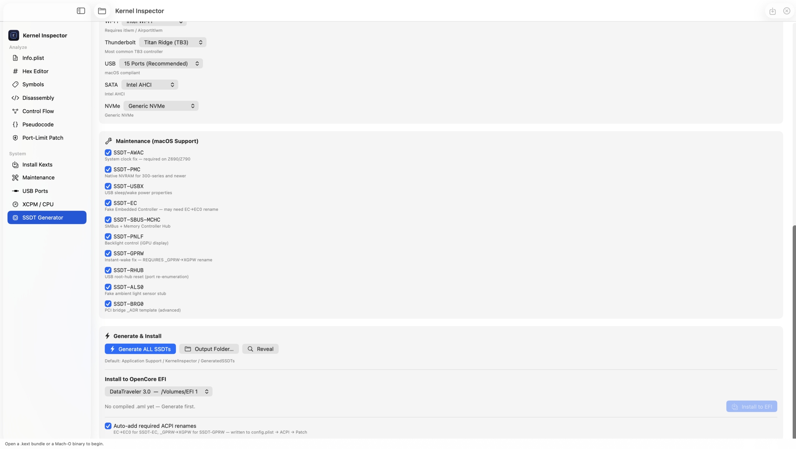
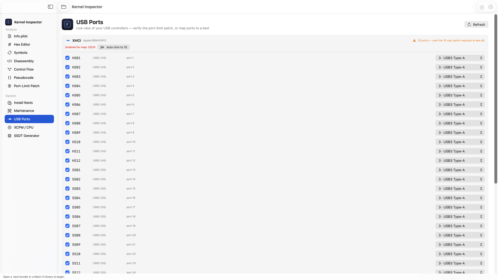
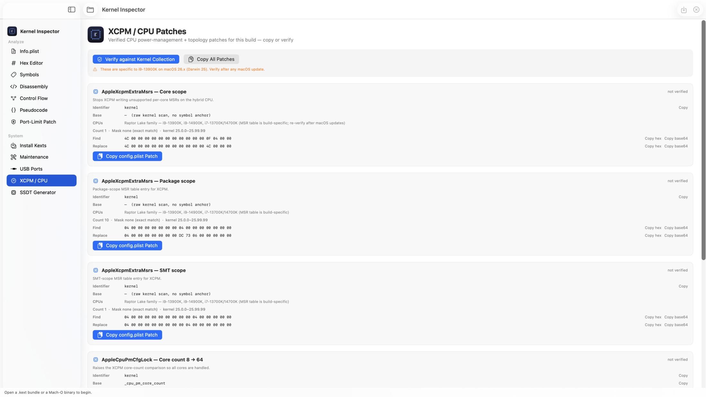
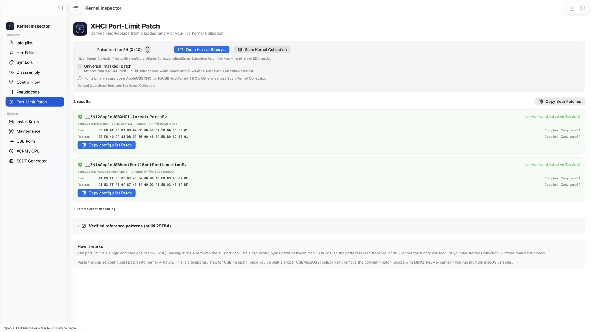
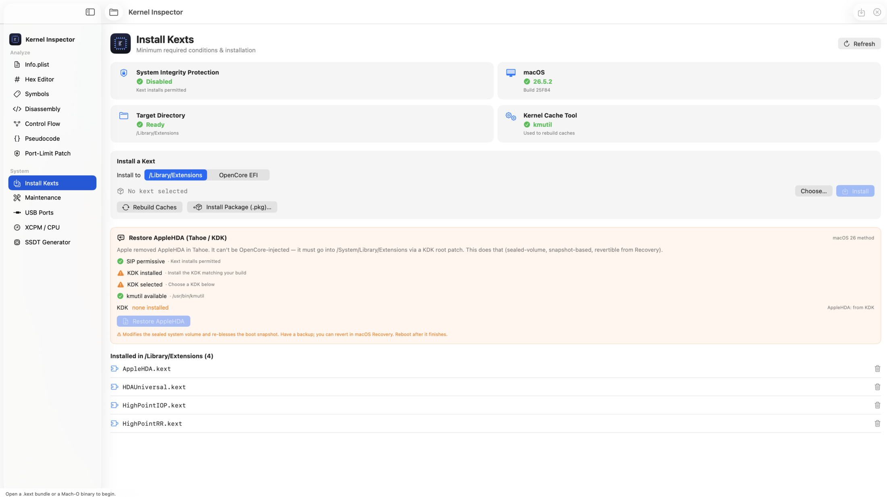
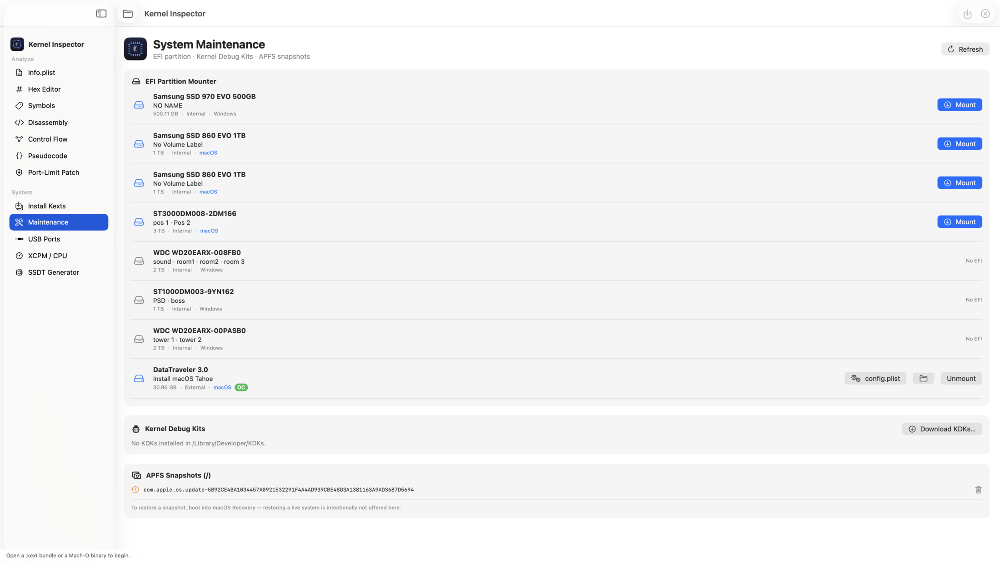
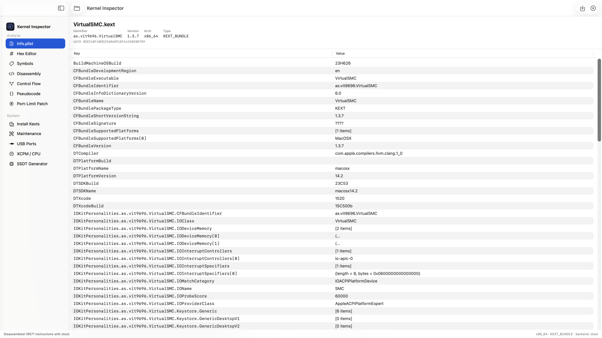
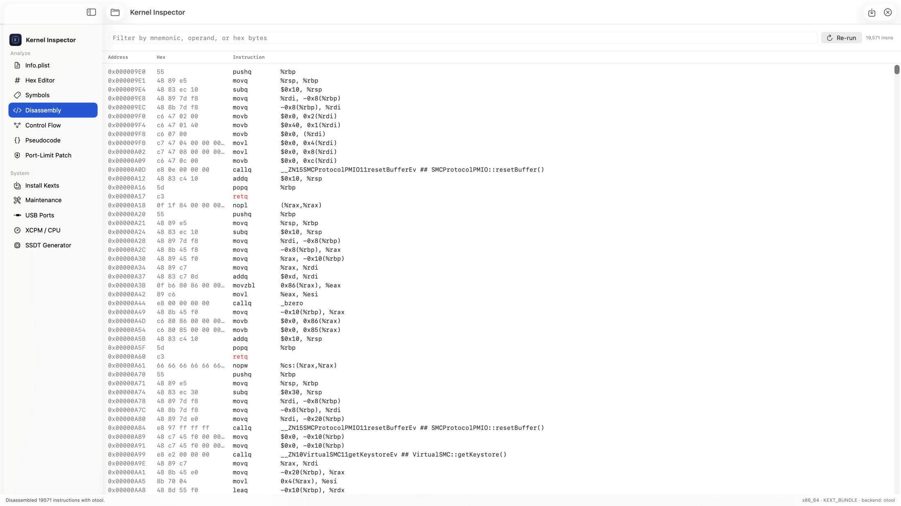
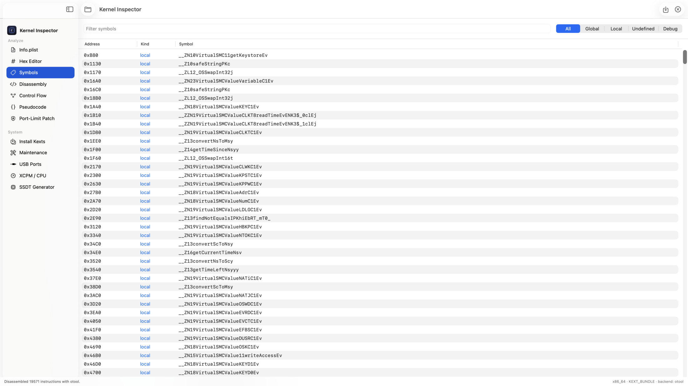

# Kernel Inspector

A macOS app that started as a **kernel-extension (`.kext`) and Mach-O inspector**
— modelled loosely on Hopper Disassembler — and has grown into an all-in-one
**Hackintosh / OpenCore toolkit**. Open a `.kext` bundle or a raw binary to
explore it, then use the system panes to generate SSDTs, derive OpenCore
patches from *your own* machine, map USB ports, and install kexts.

Everything is organised into two groups in the sidebar:

- **Analyze** — Info.plist, Hex Editor, Symbols, Disassembly, Control Flow,
  Pseudocode, and the Port-Limit Patch deriver.
- **System** — Install Kexts, Maintenance, USB Ports, XCPM / CPU, and the SSDT
  Generator.

## Screenshots

| | |
|---|---|
|  |  |
| **SSDT Generator** — pick hardware, generate & install to EFI | **USB Ports** — live port map with the 15-port cap check |
|  |  |
| **XCPM / CPU** — verified CPU patches, checked against your kernel | **Port-Limit Patch** — derived Find/Replace from real bytes |
|  |  |
| **Install Kexts** — readiness dashboard + AppleHDA restore | **Maintenance** — EFI mounter, KDKs, APFS snapshots |
|  |  |
| **Info.plist** — kext bundle browser | **Disassembly** — filtered x86-64 view |
|  | |
| **Symbols** — nlist_64 table with kind filtering | |

## Panes

### Analyze

| Pane | What it does |
|------|--------------|
| **Info.plist** | Kext bundle browser: identifier, version, UUID, linked libraries, and a flattened, searchable Info.plist table. |
| **Hex Editor** | Byte-level view with **hex find & replace**, match navigation, in-memory patching, and *Save Patched Binary…*. |
| **Symbols** | Full symbol table (nlist_64) with kind filtering (global / local / undefined / debug) and text search. |
| **Disassembly** | ARM64 / x86-64 disassembly of the `__text` section, colour-coded by branch / call / return. |
| **Control Flow** | Basic-block control-flow graph built per function, with successor edges. |
| **Pseudocode** | Experimental heuristic pseudo-C (`if (cond) goto loc_x;`) — a readability aid, not a real decompiler. |
| **Port-Limit Patch** | Derives an XHCI **port-limit** OpenCore `Kernel → Patch` from *real bytes* — either a loaded binary or your live Kernel Collection — instead of a hard-coded pattern that only matches one macOS build. Emits ready Find/Replace and a copy-paste `config.plist` entry, with an optional **universal (masked)** variant that works across builds. Ships the verified build-25F84 patterns as a reference. |

### System

| Pane | What it does |
|------|--------------|
| **Install Kexts** | Hackintosh-style installer with a system-readiness dashboard (SIP, macOS/build, target dir, cache tool). Install a `.kext` to `/Library/Extensions` **or** to a mounted OpenCore EFI, rebuild caches, install a `.pkg`, and uninstall. Includes a **Restore AppleHDA (Tahoe / KDK)** flow that root-patches AppleHDA back into the sealed system volume via a Kernel Debug Kit. Privileged steps use the macOS admin prompt — the app never sees your password. |
| **Maintenance** | System-maintenance tools: mount/unmount the **EFI partition** (with quick access to each volume's `config.plist`), manage **Kernel Debug Kits** (list, uninstall, open Apple's download page), and clean up **APFS snapshots**. Mutating actions use the macOS admin prompt. |
| **USB Ports** | Live view of your USB controllers read straight from IOKit. See every port (HS / SS / SSP / Type-C), toggle which ones to keep, set each connector type, and **auto-trim to 15** for macOS compliance — the basis for building a proper USB map. |
| **XCPM / CPU** | The verified CPU power-management + topology patch set for this machine (`AppleXcpmExtraMsrs`, `AppleCpuPmCfgLock`, core-count fixes). Copy any entry as a `config.plist` patch, or **verify against the live Kernel Collection** after a macOS update. These are CPU- and build-specific, so they ship as a checked reference rather than being derived blind. |
| **SSDT Generator** | Generate OpenCore SSDTs from your hardware — set the ACPI paths (HDEF, IGPU, GPU, SATA, NVMe, Thunderbolt, XHCI, LPC…) and toggle the maintenance tables (SSDT-AWAC, PMC, USBX, EC, PNLF, GPRW, RHUB, ALS0, and more). Compiles DSL → AML with `iasl`, then installs the `.aml` files straight into a mounted OpenCore EFI and registers them under `config.plist → ACPI → Add` — automatically adding the required ACPI renames (EC→EC0, _GPRW→XGPW) when a table needs them. |

## Requirements

- macOS 13 (Ventura) or later
- Xcode 15+ (or the Swift 5.9 toolchain)
- **Xcode Command Line Tools** — the disassembler shells out to `otool`
  (preferred) or `llvm-objdump`, both of which ship with the tools:
  ```
  xcode-select --install
  ```
- **`iasl`** (ACPI compiler) for the SSDT Generator's DSL → AML step — install
  via [acpica](https://acpica.org) or your package manager (e.g. `brew install acpica`).

## Build a double-clickable app (recommended)

This produces a real `Kernel Inspector.app` with the bundle ID
`com.lumina.KernelInspector`, an app icon, and no launch-time console warnings:

```bash
cd KernelInspector
./build_app.sh
```

The script builds a release binary, wraps it in an `.app` bundle, generates the
`.icns` icon, ad-hoc code-signs it, and opens it. The finished app lands in
`build/Kernel Inspector.app` — drag it to `/Applications` if you like.

### Why the terminal build showed warnings

Running `swift run` launches a bare executable with **no bundle identifier**, so
macOS logs harmless `com.apple.linkd.autoShortcut` / "missing main bundle
identifier" messages. The `.app` bundle above has a proper identifier, so those
messages disappear.

## Open as an Xcode project

The repo ships an [XcodeGen](https://github.com/yonaskolb/XcodeGen) spec that
generates a proper `.xcodeproj` App target:

```bash
brew install xcodegen
xcodegen generate
open KernelInspector.xcodeproj      # then press ⌘R
```

## Quick run (no bundle)

The project is also a plain Swift Package:

```bash
cd KernelInspector
swift run          # build & launch (expect the harmless warnings noted above)
open Package.swift # or open the package directly in Xcode
```

## Usage

1. Press **⌘O** (or *Open*) and choose a `.kext` bundle *or* a Mach-O file.
   Kexts are resolved to their `Contents/MacOS/<executable>` automatically.
2. The app parses the Mach-O header, load commands, segments/sections and the
   symbol table itself (no external parser), then disassembles the text section.
3. In **Hex Editor**, type a pattern like `55 48 89 E5`, press **Find**, then
   **Replace** / **Replace All** (replacement must be the same byte length).
   Use **Save Patched** (⌘S) to write the modified bytes to a new file.

The **System** panes don't need a loaded binary — they read your live machine
(IOKit, the Kernel Collection, mounted EFI volumes) directly. Anything that
writes to disk or to `config.plist` backs up first and runs behind the macOS
admin prompt.

> Kexts on disk are often SIP-protected and code-signed. Patching a copy is fine
> for study; loading a modified kext requires disabling signature enforcement and
> is outside this tool's scope.

## Architecture

```
Sources/KernelInspector/
├── KernelInspectorApp.swift     @main entry + menu commands
├── ContentView.swift            NavigationSplitView shell (Analyze / System groups)
├── Models/
│   ├── ByteReader.swift         endian-aware byte reader
│   ├── MachO.swift              FAT + thin Mach-O parser (header, LCs, sections)
│   ├── Symbol.swift             LC_SYMTAB / nlist_64 parsing
│   ├── KextBundle.swift         .kext resolution + Info.plist
│   ├── Instruction.swift        instruction model + flow heuristics
│   ├── Disassembler.swift       otool / llvm-objdump backend wrapper
│   ├── CFG.swift                basic-block / control-flow builder
│   ├── Pseudocode.swift         heuristic pseudo-C renderer
│   ├── PortLimitPatch.swift     derive XHCI port-limit patch from real bytes
│   ├── XCPMPatch.swift          verified CPU / XCPM patch set + verifier
│   ├── USBPortMap.swift         IOKit USB controller / port model
│   ├── SSDTBuilder.swift        SSDT DSL generators (+ Maintenance extension)
│   ├── SSDTCompiler.swift       DSL → AML via iasl
│   ├── SSDTInstaller.swift      install .aml into EFI/OC/ACPI + config.plist
│   ├── SSDTFileManager.swift    generated-SSDT output folder handling
│   ├── ACPIRename.swift         ACPI → Patch renames (EC→EC0, _GPRW→XGPW…)
│   ├── ACPIDetector.swift       detect ACPI paths from the live system
│   ├── KextInstaller.swift      /Library/Extensions installer
│   ├── EFIKextInstaller.swift   OpenCore EFI installer
│   ├── AppleHDARestore.swift    KDK-based AppleHDA root patch (Tahoe)
│   ├── SATAModels · NVMeModels · GPUModels · IGPUModels
│   ├── USBModels · WIFIModels · LANModels · TBModels   hardware tables
│   ├── Maintenance.swift        EFI mount, KDKs, APFS snapshots
│   └── SystemStatus.swift       SIP / build / cache-tool readiness
├── ViewModels/DocumentModel.swift   load, disassemble, patch, save
└── Views/                       one SwiftUI view per pane
```

## Swapping in Capstone (optional)

The disassembly backend is isolated in `Disassembler.swift`. To use the
[Capstone](https://www.capstone-engine.org) engine directly instead of shelling
out:

1. `brew install capstone`
2. Add a SwiftPM system-library target wrapping `<capstone/capstone.h>`.
3. Implement a `case capstone` in `Disassembler.Backend` that feeds the raw
   `__text` bytes (already available via `MachSection.offset/size` on
   `doc.fileData`) into `cs_disasm` and maps results into `Instruction`.

The rest of the app (CFG, pseudocode, views) consumes the `[Instruction]` array
unchanged.

## Notes & limitations

- Pseudocode and CFG are heuristic and best-effort; they do not do full data-flow
  or type recovery.
- The parser targets 64-bit Mach-O (the norm for modern kexts); 32-bit magic is
  recognised but less exercised.
- **XCPM / CPU** patches are specific to the machine they were verified on
  (i9-13900K, macOS 26.x / Darwin 25). Always re-verify against your live Kernel
  Collection after a macOS update before using them.
- The **Port-Limit Patch** is a temporary aid for USB mapping — once you've built
  a proper USBMap / USBToolBox kext, remove the port-limit patch.
- SSDT generation and the OpenCore/EFI install actions modify your boot
  configuration. `config.plist` is backed up first, but keep your own backup and
  know how to recover your EFI.
- This is a study / reverse-engineering and Hackintosh aid for hardware you own.
